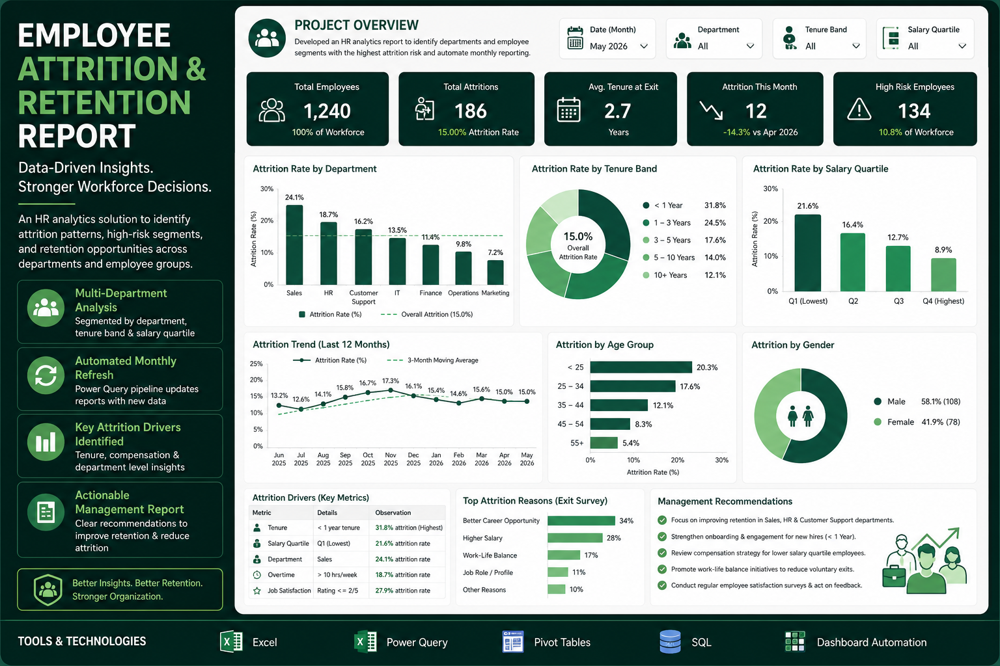

# 📊 Employee_Attrition_Retention_Report

**Employee_Attrition_Retention_Report** is a Python-based data analytics project focused on analyzing employee records across demographic, departmental, salary, employment-status, performance, and work-mode variables.

The project uses **Python, Pandas, and Matplotlib** to clean, transform, analyze, and visualize employee data, converting a messy employee dataset into a structured dataset suitable for analysis and reporting.

The analysis focuses on variables such as **age, department and region, employee status, joining date, salary, performance score, remote work, and total salary**, providing insights into employee distribution, compensation, performance, and work patterns.

---



## 🚀 Core Features

The project implements a complete data analytics workflow:

### 1. **Data Cleaning & Transformation**

* Loaded the raw employee dataset using Pandas.
* Examined dataset dimensions, columns, data types, and summary statistics.
* Identified missing values in important fields such as **Age** and **Salary**.
* Calculated mean age and median salary for missing-value analysis.
* Removed records containing missing values using `dropna()`.
* Checked for duplicate records and removed duplicates where required.
* Corrected selected data values.
* Created a fixed **bonus** value of 5,000.
* Created a derived **Total_salary** column using salary + bonus.
* Validated the cleaned dataset before exporting it.

The original dataset contained **1,020 rows and 12 columns**. After preprocessing and removing incomplete records, the final dataset contained **787 rows and 14 columns**.

### 2. **Exploratory Data Analysis**

The project explores employee information using Pandas operations such as:

```python
df.head()
df.tail()
df.shape
df.size
df.columns
df.index
df.dtypes
df.info()
df.describe()
```

The analysis examines:

* Employee demographics
* Age distribution
* Department and region distribution
* Employee status
* Salary statistics
* Remote-work distribution
* Performance scores
* Highest and lowest salaries
* Employees above or below average salary
* Top-paid employees

The dataset contains variables including **Employee_ID, First_Name, Last_Name, Age, Department_Region, Status, Join_Date, Salary, Email, Phone, Performance_Score, and Remote_Work**.

### 3. **Salary Analysis**

Salary-related analysis was performed using descriptive statistics.

The cleaned dataset shows:

* **Average Salary:** approximately 85,061
* **Median Salary:** approximately 84,973
* **Minimum Salary:** 50,047.32
* **Maximum Salary:** 119,764.20
* **Salary Standard Deviation:** approximately 19,996
* **Bonus:** 5,000
* **Total Salary:** Salary + Bonus

The notebook calculates total salary using:

```python
df['Total_salary'] = df['Salary'] + df['bonus']
```

The resulting total salary ranges from approximately **55,047 to 124,765**.

### 4. **Employee Distribution Analysis**

The project analyzes employee distribution across department-region combinations.

The cleaned dataset contains **37 department-region categories**, including combinations such as:

* HR
* Finance
* Sales
* Admin
* DevOps
* Cloud Tech
* IT

The most frequently represented department-region combination in the cleaned data is **HR-Florida**, with 33 employees.

### 5. **Work Mode Analysis**

Employee work mode was analyzed using the `Remote_Work` column.

The cleaned dataset contains:

* **398 Remote employees**
* **389 Non-remote employees**

This provides a comparison of remote and non-remote work distribution within the employee dataset.

### 6. **Performance Analysis**

Employee performance was analyzed using the `Performance_Score` variable.

The dataset contains performance categories such as:

* Excellent
* Good
* Average
* Poor

A bar chart was created to visualize the distribution of employees across performance-score categories.

### 7. **Employee Status Analysis**

Employee employment status was analyzed using the `Status` column.

The dataset contains three status categories:

* Active
* Pending
* Inactive

A pie-chart visualization was created to show the distribution of employee status.

---

## 📈 Key Analysis Areas

| Analysis Area             | Description                                                           |
| :------------------------ | :-------------------------------------------------------------------- |
| **Employee Demographics** | Analyzed employee age and personal information                        |
| **Department & Region**   | Examined employee distribution across department-region combinations  |
| **Employee Status**       | Analyzed Active, Pending, and Inactive employees                      |
| **Salary Analysis**       | Calculated average, median, minimum, maximum, and variation in salary |
| **Total Salary**          | Calculated total compensation using salary plus bonus                 |
| **Performance**           | Examined employee performance-score categories                        |
| **Remote Work**           | Compared remote and non-remote employees                              |
| **Age & Salary**          | Visualized the relationship between employee age and total salary     |
| **Salary Distribution**   | Examined the distribution of employee total salaries                  |

---

## 🛠️ Technology Stack

| Category          | Technology                          | Description                                                                  |
| :---------------- | :---------------------------------- | :--------------------------------------------------------------------------- |
| **Language**      | **Python**                          | Core programming and analysis language                                       |
| **Data Analysis** | **Pandas**                          | Data loading, cleaning, transformation, and analysis                         |
| **Visualization** | **Matplotlib**                      | Creation of employee and salary visualizations                               |
| **Notebook**      | **Jupyter Notebook / Google Colab** | Complete data-analysis workflow                                              |
| **Dataset**       | **Employee Records**                | Employee demographic, salary, status, performance, and work-mode information |

The notebook uses Pandas for data processing and Matplotlib for the final visualizations.

---

## 📂 Project Structure

```text
Employee_Attrition_Retention_Report/
│
├── data/
│   ├── raw dataset/
│   │      └── Messy_Employee_dataset.csv
│   │
│   └── cleaned dataset/
│          ├── Cleaned_Employee_dataset.csv
│          ├── Cleaned_Employee_dataset.json
│          └── Cleaned_Employee_dataset.xlsx
│
├── notebook/
│   └── Employee_Attrition_Retention_Report(2).ipynb
│
├── presentation/
│   └── Employee_Attrition_Retention_Report.pptx
│
├── visualization/
│   ├── Age vs Total salary.png
│   ├── Average Salary By Age.png
│   ├── Employee_Attrition_&_Retention_Report.png
│   ├── Employee Performance Score.png
│   ├── Employee Status Distribution.png
│   │ 
│   ├── Number of Employee by Department.png
│   └── Salary Distribution.png
│
└── README.md
```

The notebook exports the cleaned dataset into **CSV, Excel, and JSON** formats.

---

## 🔄 Data Analytics Workflow

```text
Raw Employee Dataset
        ↓
Data Loading
        ↓
Data Inspection
        ↓
Data Cleaning
        ↓
Missing Value Analysis
        ↓
Duplicate Check
        ↓
Data Transformation
        ↓
Total Salary Calculation
        ↓
Exploratory Data Analysis
        ↓
Descriptive Statistics
        ↓
Data Visualization
        ↓
Insight Generation
        ↓
Employee Attrition & Retention Report
```

---

## 🔍 Data Cleaning & Transformation

The raw employee dataset was prepared for analysis through several preprocessing steps.

### Data Inspection

The original dataset contained:

* **1,020 employee records**
* **12 original columns**
* Employee ID
* First name
* Last name
* Age
* Department and region
* Status
* Join date
* Salary
* Email
* Phone
* Performance score
* Remote work

### Missing Value Analysis

Missing values were identified using:

```python
df.isnull().sum()
```

The notebook identified:

* **211 missing Age values**
* **24 missing Salary values**
* **24 missing Total_salary values**

Mean and median calculations were also performed:

```python
df["Age"].mean()
df["Salary"].median()
```

The calculated mean age was approximately **32.48**, while the salary median used for analysis was approximately **85,547.87**.

### Duplicate Analysis

Duplicate records were checked using:

```python
df.duplicated()
df.duplicated().sum()
df.drop_duplicates(inplace=True)
```

After cleaning, no duplicate records were identified in the resulting dataset.

### Derived Column

A fixed bonus of **5,000** was added and the following derived column was created:

```python
df['Total_salary'] = df['Salary'] + df['bonus']
```

### Final Dataset

After removing rows containing missing values, the final dataset contained:

**787 rows × 14 columns**

---

## 📊 Exploratory Data Analysis

Exploratory analysis was performed to understand the overall characteristics of the employee dataset.

Key operations included:

```python
df.head()
df.tail()
df.shape
df.size
df.columns
df.dtypes
df.info()
df.describe()
```

The analysis examined:

* Employee age
* Department and region
* Employee status
* Joining dates
* Salary
* Performance scores
* Remote-work status
* Total salary
* Salary ranking
* Department distribution

The project also performed filtering and sorting operations to identify employees based on salary, age, department, and other conditions.

---

## 📉 Data Visualization

The project contains **7 main employee-data visualizations** created using Matplotlib.

### 1. Number of Employees by Department

A bar chart showing the number of employees across department-region categories.

```python
df["Department_Region"].value_counts().plot(kind="bar")
```

### 2. Average Salary by Age

A line chart showing average total salary for different employee age groups.

```python
avg_salary = df.groupby("Age")["Total_salary"].mean()
plt.plot(avg_salary.index, avg_salary.values, marker="o")
```

### 3. Salary Distribution

A histogram showing how employee total salaries are distributed.

```python
plt.hist(df["Total_salary"], bins=15)
```

### 4. Age vs Total Salary

A scatter plot comparing employee age with total salary.

```python
plt.scatter(df["Age"], df["Total_salary"])
```

### 5. Employee Work Distribution

A pie chart showing the distribution between remote and non-remote employees.

### 6. Employee Performance Score

A bar chart showing the number of employees in each performance-score category.

### 7. Employee Status Distribution

A pie chart showing the distribution of Active, Pending, and Inactive employees.

---

## 💰 Salary Statistics

The cleaned employee dataset produced the following salary statistics:

| Statistic                     |         Value |
| :---------------------------- | ------------: |
| **Total Salary Sum**          | 66,943,330.80 |
| **Average Salary**            |     85,061.41 |
| **Median Salary**             |     84,972.70 |
| **Minimum Salary**            |     50,047.32 |
| **Maximum Salary**            |    119,764.20 |
| **Salary Standard Deviation** |     19,996.22 |
| **Bonus per Employee**        |         5,000 |

The highest salary in the cleaned dataset was **119,764.20**, while the lowest was **50,047.32**.

---

## 👥 Employee Distribution

The cleaned dataset contains **787 employees** distributed across department-region combinations.

The highest-frequency department-region combination was:

**HR-Florida — 33 employees**

Other highly represented combinations include:

* Sales-Nevada
* HR-New York
* DevOps-Illinois
* Admin-Nevada
* Finance-Illinois

---

## 🏠 Remote Work Analysis

Remote-work distribution in the cleaned dataset:

| Work Mode      | Employees |
| :------------- | --------: |
| **Remote**     |       398 |
| **Non-Remote** |       389 |

This shows a relatively balanced distribution between remote and non-remote employees.

---

## 💡 Key Outcomes

The project successfully transformed a messy employee dataset into a structured analytical dataset.

### Major outcomes:

* Analyzed **1,020 original employee records**.
* Worked with **12 original employee variables**.
* Created **2 additional variables**: `bonus` and `Total_salary`.
* Performed missing-value analysis.
* Used mean and median techniques for missing-value investigation.
* Removed incomplete records for the final cleaned dataset.
* Checked for duplicate records.
* Final cleaned dataset contains **787 employees and 14 columns**.
* Calculated descriptive salary statistics.
* Identified the highest and lowest salary values.
* Analyzed employee distribution across departments and regions.
* Compared remote and non-remote employees.
* Analyzed employee performance categories.
* Analyzed Active, Pending, and Inactive employee statuses.
* Created **7 different visualizations** using Matplotlib.
* Exported the cleaned dataset into **CSV, Excel, and JSON** formats.
* Prepared the analysis for an **Employee Attrition & Retention Report**.

---

## 📦 Requirements

```text
Python
Pandas
Matplotlib
Jupyter Notebook
```

Install the required libraries:

```bash
pip install pandas matplotlib jupyter
```

---

## ▶️ Running the Project

### 1️⃣ Clone the Repository

```bash
git clone https://github.com/varshugumma27-crypto/Employee_Attrition_Retention_Report.git
cd Employee_Attrition_Retention_Report
```

### 2️⃣ Install Dependencies

```bash
pip install pandas matplotlib jupyter
```

### 3️⃣ Start Jupyter Notebook

```bash
jupyter notebook
```

### 4️⃣ Open the Analysis Notebook

Open:

```text
notebook/Employee_Attrition_and_Retention_Study.ipynb
```

Run the notebook cells sequentially to reproduce the complete employee-data analysis.

---

## 🎯 Project Objective

The primary objective of this project is to demonstrate a complete **employee data analytics workflow**, starting from a messy employee dataset and progressing through **data inspection, cleaning, transformation, exploratory analysis, descriptive statistics, visualization, and insight presentation**.

The project demonstrates how Python-based data analytics can be used to transform raw employee records into meaningful information about **employee distribution, salary patterns, performance, employment status, remote work, and departmental structure**.

The final analysis provides a structured foundation for understanding employee characteristics and supporting data-driven HR decision-making.